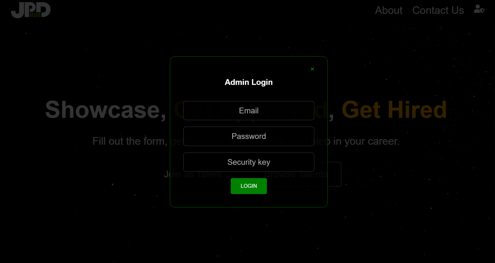
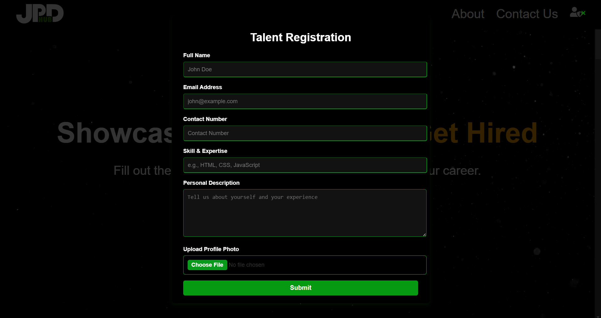
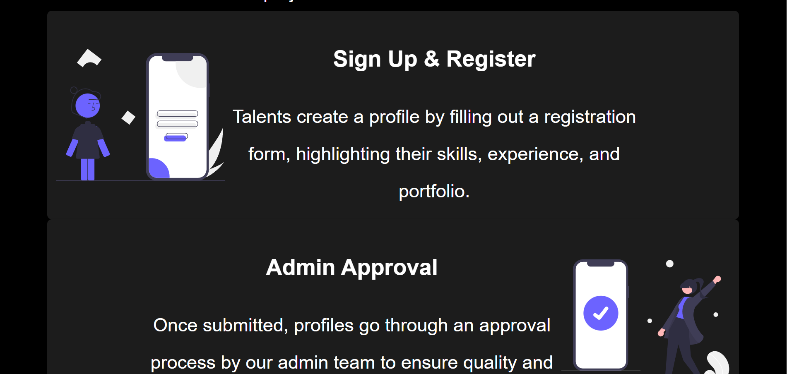
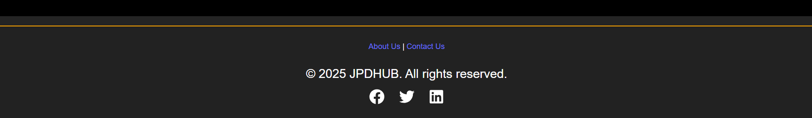
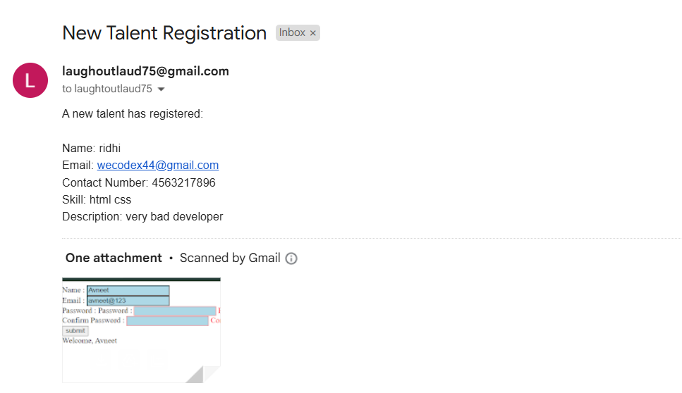

# JPD Hub - Talent Module

JPD Hub is an innovative platform aimed at connecting talented individuals with clients seeking specialized skills. The Talent Module allows users to showcase their skills, get approved by the admin, and get hired by clients worldwide.

## Features

- **User Registration**: Talents can sign up and register by filling out a profile with their skills, experience, and portfolio.
- **Admin Approval**: All profiles are subject to admin approval to ensure quality and professionalism.
- **Get Discovered**: Once approved, talents are visible to clients actively seeking experts in their fields.
- **Hire & Collaborate**: Clients can browse through the talent pool and hire the best talent for their projects.

## Images










## Gmail integration
## user notification 


## admin notification

## Admin Login

To manage the platform and approve user profiles, admin access is required.

### Admin Credentials:

- **Email**: laughoutlaud75@.com
- **Password**: laugh123
- **Security Key**: admin@JPD

### Steps to Admin Login:

1. Navigate to the **Admin Login** section.
2. Enter the **Email**, **Password**, and **Security Key** in the respective fields.
3. If the credentials are correct, you will be logged in as an Admin, and you will be able to manage the profiles of talents and approve or reject them based on the platform's standards.

## Installation Instructions

To run the project locally, follow these steps:

### Prerequisites

- **Node.js** (v16.0.0 or higher)
- **npm** (v8.0.0 or higher)

### Steps

1. Clone the repository:

   ```bash
   git clone https://github.com/your-repo/Hackathon.git
